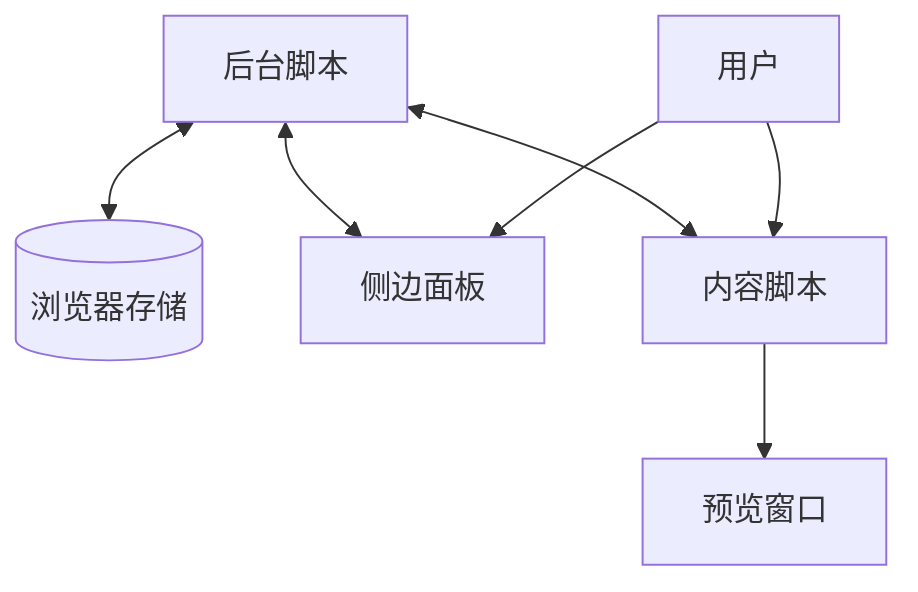

# 系统架构

## 整体架构
链接预览助手采用典型的Chrome扩展架构，基于Manifest V3规范实现，主要包含以下核心组件：

1. **后台脚本（Background Script）**：负责管理扩展的全局状态、处理设置存储和变更、响应快捷键命令，以及在不同标签页之间协调通信。

2. **内容脚本（Content Script）**：注入到用户访问的网页中，负责监听用户交互（如点击、悬停等），处理链接元素，创建和管理预览窗口。

3. **侧边面板（Side Panel）**：提供用户友好的设置界面，允许用户自定义预览触发方式、窗口大小、位置和主题。

## 设计模式

### 观察者模式
- 后台脚本作为发布者，当设置变更时通知所有活动的内容脚本（订阅者）。
- 内容脚本监听DOM事件（如mouseover、click等），根据当前触发模式执行相应操作。

### 状态管理
- 使用浏览器的storage API存储用户设置。
- 后台脚本维护当前设置状态，并在设置变更时广播到所有活动标签页。

## 组件关系

## 关键技术决策

1. **使用React构建侧边面板**：提供现代化、响应式的用户界面。

2. **采用TypeScript**：增强代码可维护性和类型安全。

3. **使用WXT开发框架**：简化Chrome扩展开发流程，提供更好的开发体验。

4. **内容预览实现**：使用iframe加载目标链接内容，确保安全隔离。

5. **多种触发模式**：支持多种交互方式（Alt+悬停、Alt+点击、长按等），提高用户体验的灵活性。